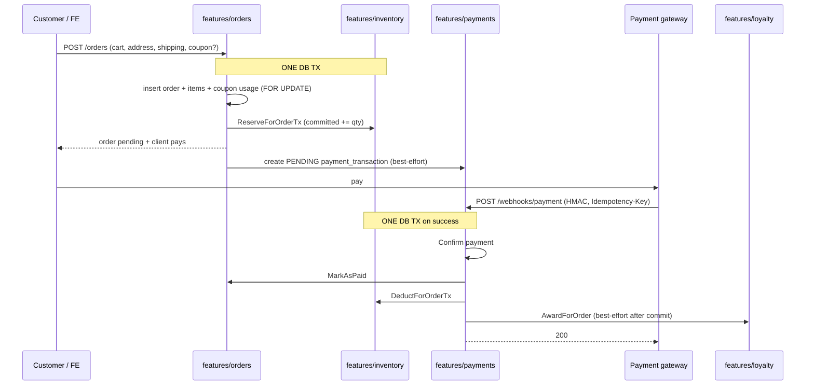

# Money and stock sagas

**Who this is for:** anyone who must understand how **orders, payments, inventory,
coupons, wallet, and loyalty** interact without reading every service file.

**Status:** as-built narrative (2026-08-11). Code lives under `internal/features/*`
(not the old `internal/services` paths some older snippets mention).

**Companions:** [inventory.md](./inventory.md) · [payments-and-webhooks.md](./payments-and-webhooks.md) ·
[domain-map.md](./domain-map.md) · monorepo dual-doc [DOCUMENTATION-DUAL-TRACK.md](../../../../docs/DOCUMENTATION-DUAL-TRACK.md)

---

## Invariants (memorise these)

1. **Sellable stock** = `available = on_hand − committed` — never sell on-hand alone.
2. **Place order** reserves stock in the **same Postgres transaction** as the order (+ items + coupon usage under lock).
3. **Payment success** marks paid + **deducts** stock in the **same transaction**.
4. **Payment fail / cancel** **releases** reserved stock (must not leave permanent commitment).
5. **No free money** — wallet credit is admin-gated (idempotent) or future gateway top-up; not a public free deposit.
6. **Loyalty earn** is after **paid** (best-effort after confirm TX). Full earn catalogue + refund clawback policy: [loyalty.md](./loyalty.md) (PH-040a).
7. **Webhook** is at-least-once → **idempotency** on webhook + unique gateway transaction identity (hardening: program PH-011).

---

## Saga A — Happy path: first purchase



**Packages:** `features/orders`, `features/inventory`, `features/payments`,
`features/coupons` (via order TX), `features/cart` (clear after commit),
`features/loyalty` / `features/referral` (post-paid side effects).

---

## Saga B — Payment failed

```mermaid
sequenceDiagram
  participant GW as Gateway
  participant P as features/payments
  participant I as features/inventory

  GW->>P: webhook status=failed
  P->>P: Fail payment / order path
  P->>I: ReleaseForOrder (committed -= qty)
  Note over I: on_hand unchanged; available restored
```

Release must not be discarded silently — ops observability and tests matter
(program PH-013 / PH-011).

---

## Saga C — Coupon under concurrency

Inside CreateOrder TX:

1. Pre-validate coupon (cheap).
2. `LockByID` (`SELECT … FOR UPDATE`) on coupon row.
3. Re-check usage limits.
4. Insert usage + reserve stock + order.

Two concurrent checkouts cannot both burn the last use.

---

## Saga D — Wallet admin credit

```text
Admin POST /admin/users/:id/wallet/credit
  + capability customers:write (or equivalent)
  + confirmation UX (FE)
  + idempotency_key (service-level; platform alignment PH-011)
  → ledger row + balance increase
  → never use this as “customer free deposit”
```

Customer **read** of balance/ledger is customer-tier. Customer **funded top-up**
via gateway is product work **PH-041** (depends on PH-011).

---

## Saga E — Gift card redeem

Customer redeems code → credit wallet / balance path with **one-time** use
semantics. Purchase-of-card (customer buy) is **PH-042**. Redeem must remain
idempotent under retries.

---

## Saga F — Webhook / client retry

Gateway may POST the same success twice; checkout may double-submit.

| Layer | Protection |
|-------|------------|
| HTTP | Idempotency middleware (webhook today; all P0 money routes via PH-011c) |
| DB | Unique natural key on gateway `transaction_id` (harden PH-011d — index exists, UNIQUE pending) |
| Service | Confirm only from pending; domain keys (order loyalty, gift card status, admin credit marker) |

**Full ADR + route inventory:** [idempotency.md](./idempotency.md) (PH-011a).

Client retries on `POST /orders` / redeem / loyalty spend are **not** fully
platform-wired yet — implementation is PH-011b…e.

---

## Lock ordering (deadlock avoidance)

When multiple variants are reserved in one order, **sort by `variant_id`**
before taking row locks so concurrent checkouts do not deadlock (40P01).
Preserve this in any rewrite of Reserve/Release/Deduct loops.

---

## What is intentionally deferred

| Topic | Status |
|-------|--------|
| Multi-warehouse | Not now — single stock pool |
| Multi-currency | Not now — Toman |
| Crypto rails | Maybe later — enum may already allow `crypto` as method label only |
| Full idempotency platform on all money POSTs | PH-011 |
| Netflix-style digital entitlement | Out of product scope |

---

## Related Obsidian

- Money rules · Inventory · Payments · Orders · Wallet · Loyalty domains  
- Journeys: First purchase · Payment webhook settle · Account wallet  
- Playbooks: Debug Oversell · Debug Webhook · Document a change  
