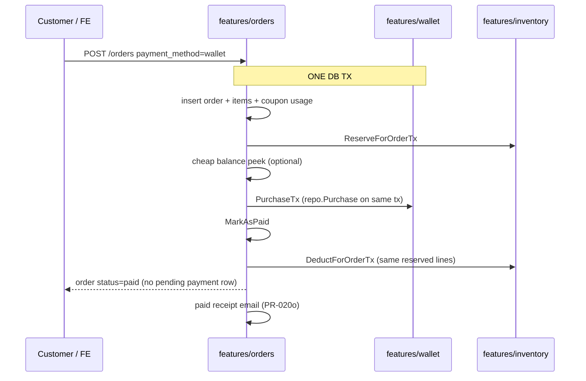
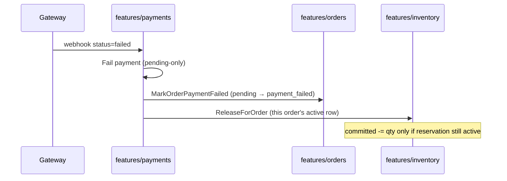
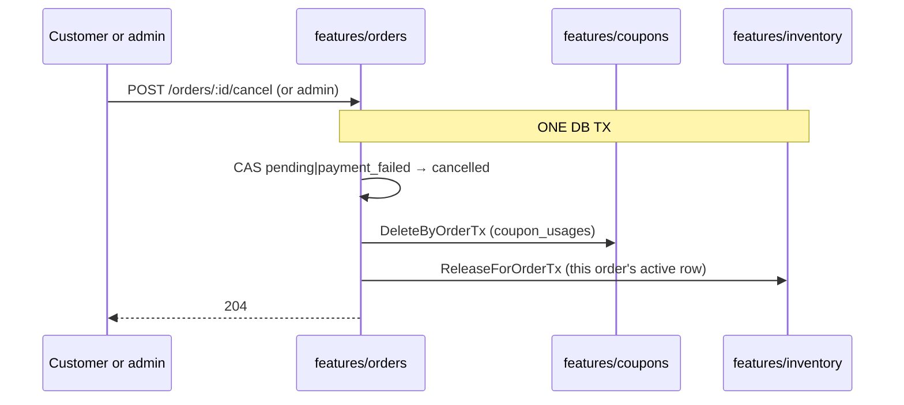

# Money and stock sagas

**Who this is for:** anyone who must understand how **orders, payments, inventory,
coupons, wallet, and loyalty** interact without reading every service file.

**Status:** as-built narrative (2026-08-11). Code lives under `internal/features/*`
(not the old `internal/services` paths some older snippets mention).

**Companions:** [inventory.md](./inventory.md) · [payments-and-webhooks.md](./payments-and-webhooks.md) ·
[domain-map.md](./domain-map.md) · monorepo dual-doc [DOCUMENTATION-DUAL-TRACK.md](../../../../docs/DOCUMENTATION-DUAL-TRACK.md)

---

## Invariants (memorise these)

1. **Sellable stock** = `available = on_hand − committed` — never sell on-hand alone.
2. **Place order** reserves stock in the **same Postgres transaction** as the order (+ items + coupon usage under lock).
3. **Payment success** marks paid + **deducts** stock in the **same transaction**. `MarkAsPaid` stamps `paid_at` (`COALESCE(paid_at, NOW())`) so webhook-paid orders appear in `paid_from` / `paid_to` filters (PR-020h). **Wallet checkout** does this on `POST /orders` itself: `PurchaseTx` + `MarkAsPaid` + `DeductForOrderTx` share the create TX (PR-020a). Insufficient funds (`INSUFFICIENT_FUNDS`) roll the reserve back — no pending order, no committed stock.
4. **Payment fail / cancel** **releases** reserved stock (must not leave permanent commitment). Fail flips the order to `payment_failed` (pending-only) so `MarkAsPaid` cannot settle a late success. **Customer/admin cancel** (`POST /orders/:id/cancel` / `POST /admin/orders/:id/cancel`) sets `cancelled`, reverses coupon usage, and releases stock in **one TX** (PR-020j). Release errors are not swallowed. Release/deduct are bound to `inventory_reservations` (PR-020b) — a re-release or late deduct must not steal another order’s committed units.
5. **No free money** — wallet credit is admin-gated (idempotent) or gateway top-up (PH-041a). Intents include `payment_url` from `PAYMENT_START_BASE_URL` (PR-005a); empty URL is not paid.
6. **Loyalty earn** is after **paid**. Confirm writes a `payment_loyalty_awards` row in the **same TX** as money/stock, then retries `AwardForOrder` / `OnPaidOrder` after commit. A failed award must **not** roll back the payment; leftover rows stay pending (`awarded_at` NULL) for `ProcessPendingLoyaltyAwards`. Full earn catalogue + refund clawback policy: [loyalty.md](./loyalty.md) (PH-040a, PR-003h). Full `refunded` status claws order earn (balance only, PR-003i); wallet / restock / coupon refund is PR-020d. The **receipt email** is the same “after paid” rule (PR-020o): `payments.Confirm` or wallet-paid `POST /orders`, never unpaid create.
7. **Webhook** is at-least-once → **idempotency** on webhook + unique gateway transaction identity (hardening: program PH-011).
8. **Currency is IRT** — checkout `payment_transactions` use `orders.defaultCurrency = "IRT"` (PR-020g), matching wallet/gift intents and the table default. Amounts are Toman. Multi-currency is deferred.
9. **Tax base includes gift add-ons** — `TaxRate` 0.08 applies to post-discount merchandise plus selected gift add-on fees (IR VAT-style on the paid add-on); shipping is excluded. The rate is not admin-editable (PR-020p).
10. **Warehouse PATCH is not a money command** — optional `tracking_number` / `parcel_carrier` may be stored on `shipped` / `out_for_delivery` (PR-020r); that path does not move money or stock.

---

## Saga A — Happy path: first purchase

```mermaid
sequenceDiagram
  participant C as Customer / FE
  participant O as features/orders
  participant I as features/inventory
  participant P as features/payments
  participant GW as Payment gateway
  participant L as features/loyalty

  C->>O: POST /orders (cart, address, shipping, coupon?)
  Note over O,I: ONE DB TX
  O->>O: insert order + items + coupon usage (FOR UPDATE)
  O->>I: ReserveForOrderTx (committed += qty)
  O-->>C: order pending + client pays
  O->>P: create PENDING payment_transaction (best-effort)
  C->>GW: pay
  GW->>P: POST /webhooks/payment (HMAC, Idempotency-Key)
  Note over P,I: ONE DB TX on success
  P->>P: Confirm payment
  P->>O: MarkAsPaid
  P->>I: DeductForOrderTx
  P->>P: insert payment_loyalty_awards (intent)
  P->>L: AwardForOrder (retry after commit; leave row if still failing)
  P->>O: paid receipt email (PR-020o; log on failure)
  P-->>GW: 200
```

**Packages:** `features/orders`, `features/inventory`, `features/payments`,
`features/coupons` (via order TX), `features/cart` (clear after commit),
`features/loyalty` / `features/referral` (post-paid side effects).

Non-wallet rails (`card`, `gateway`, `bank_transfer`, `crypto`) still follow
this path. `payment_method=wallet` is **Saga A-wallet** below.

---

## Saga A-wallet — Wallet checkout (PR-020a)



- Shortfall → `INSUFFICIENT_FUNDS` (4xx). Deferred rollback undoes order + reserve.
- Does **not** call `createPendingPayment` (no unpaid gateway row).
- Gateway pay-again is PR-020f. Refunds are PR-020d.

---

## Saga B — Payment failed



Release must not be discarded silently — ops observability and tests matter
(program PH-013 / PH-011). Terminal failed replays ACK without re-running
compensation. Late `succeeded` after fail: `MarkAsPaid` rejects
`payment_failed`; deduct has no active reservation (PR-020b).

---

## Saga B2 — Unpaid cancel (PR-020j)



- Already `cancelled` → `409 ORDER_CANCELLED`. Paid-like / refunded → `409 ORDER_ALREADY_PAID`. Missing / not owned → `404`.
- Admin uses the same path without the `user_id` filter. PATCH `cancelled` is rejected.
- TTL expire still leaves coupon usage in place (`payment_failed` can still pay via PR-020f).
- Refunds still do **not** restore coupon uses.

---

## Saga C — Coupon under concurrency

Inside CreateOrder TX:

1. Pre-validate coupon (cheap).
2. `LockByID` (`SELECT … FOR UPDATE`) on coupon row.
3. Re-check usage limits.
4. Insert usage + reserve stock + order.

Two concurrent checkouts cannot both burn the last use.

---

## Saga D — Wallet admin credit

```text
Admin POST /admin/users/:id/wallet/credit
  + capability customers:write (or equivalent)
  + confirmation UX (FE)
  + idempotency_key (service-level; platform alignment PH-011)
  → ledger row + balance increase
  → never use this as “customer free deposit”
```

Customer **read** of balance/ledger is customer-tier. Customer **funded top-up**
via gateway is product work **PH-041** (depends on PH-011).

---

## Saga E — Gift card redeem

Customer redeems code → credit wallet / balance path with **one-time** use
semantics. Purchase-of-card (customer buy) is **PH-042**. Redeem must remain
idempotent under retries.

---

## Saga F — Webhook / client retry

Gateway may POST the same success twice; checkout may double-submit.

| Layer | Protection |
|-------|------------|
| HTTP | Idempotency middleware (webhook today; all P0 money routes via PH-011c) |
| DB | Unique natural key on gateway `transaction_id` (harden PH-011d — index exists, UNIQUE pending) |
| Service | Confirm only from pending; domain keys (order loyalty, gift card status, admin credit marker) |

**Full ADR + route inventory:** [idempotency.md](./idempotency.md) (PH-011a).

Client retries on `POST /orders` / redeem / loyalty spend are **not** fully
platform-wired yet — implementation is PH-011b…e.

---

## Lock ordering (deadlock avoidance)

When multiple variants are reserved in one order, **sort by `variant_id`**
before taking row locks so concurrent checkouts do not deadlock (40P01).
Preserve this in any rewrite of Reserve/Release/Deduct loops.
`GetStockLines` returns lines sorted by `VariantID` ascending (PR-020k) so
webhook deduct/release inherit that lock order.
`GetStockLines` reads `order_items` (`product_variant_id`, `quantity`) only —
no `products` join — so a deleted catalogue row still deducts/releases
(PR-020m). GetItems stays joined for display.

---

## What is intentionally deferred

| Topic | Status |
|-------|--------|
| Multi-warehouse | Not now — single stock pool |
| Multi-currency | Not now — Toman |
| Crypto rails | Maybe later — enum may already allow `crypto` as method label only |
| Full idempotency platform on all money POSTs | PH-011 |
| Netflix-style digital entitlement | Out of product scope |

---

## Related Obsidian

- Money rules · Inventory · Payments · Orders · Wallet · Loyalty domains  
- Journeys: First purchase · Payment webhook settle · Account wallet  
- Playbooks: Debug Oversell · Debug Webhook · Document a change  
